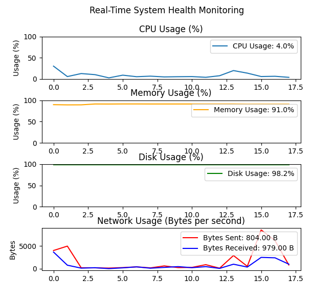

# Real-Time System Health Monitoring

This Python script monitors system health metrics in real-time using `psutil` and `matplotlib`.

## Features

- **CPU Usage:** Tracks CPU utilization percentage.
- **Memory Usage:** Monitors RAM usage percentage.
- **Disk Usage:** Displays disk usage percentage of the first partition found.
- **Network Usage:** Shows bytes sent and received per second.

## Requirements

- Python 3.x
- `psutil` library (`pip install psutil`)
- `matplotlib` library (`pip install matplotlib`)

## Usage

1. Clone the repository or download the `monitoring.py` file.
2. Install dependencies: `pip install -r requirements.txt` (if using a requirements file).
3. Run the script: `python monitoring.py`.
4. View real-time system metrics in the generated plots.

## Example Output

## Notes

- Adjust plot update intervals (`interval` parameter in `FuncAnimation`) as needed.
- Ensure sufficient permissions for accessing system metrics, especially on non-Windows platforms.

## Author

- [Otmane Echaibi](https://github.com/fa5tworm)

## License

This project is licensed under the MIT License - see the LICENSE file for details.
